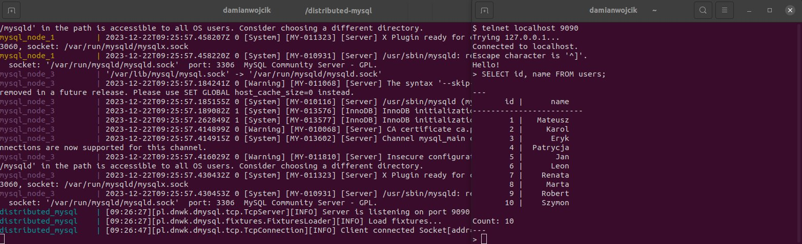

# Distributed MySQL

Application for managing multiple MySql instances under one module. 
Applies sharding, node selection and transaction management.
Executes distributed statements.



### Run in Docker

```bash
docker-compose build
```

```bash
docker-compose up
```

If everything is ok, it will show up message

```
[INFO] Server is listening on port 9090
```


### Run locally
To run locally, first configure database access in `src/main`
```
config.cluster.nodes.put("dmysql_1", NodeConfig.create()
        .setUrl("mysql://mysql-node-1:3306/dmysql_db")
        .setUser("dmysql")
        .setPassword("change-me-nf342bfc2")
        .setSchema("dmysql_db")
);
```

Then install dependencies and build app

```bash
mvn -DskipTests dependency:resolve clean package
```

Then app can be run using

```bash
java -jar target/distributed-mysql-1.0-jar-with-dependencies.jar
```
or
```bash
mvn exec:java
```

### Run tests in docker
```bash
docker-compose -f docker-compose.test.yaml build
docker-compose -f docker-compose.test.yaml up
```

### Run tests locally
Configure database access in `src/test/java/pl/dnwk/dmysql/TestCluster`
```
config.nodes = new HashMap<>() {{
    put("dmysql_1", NodeConfig.create()
            .setUrl("mysql://mysql-node-1:3306/" + schema)
            .setUser(user)
            .setPassword(password)
            .setSchema(schema)
    );
```

and run

```bash
mvn test
```